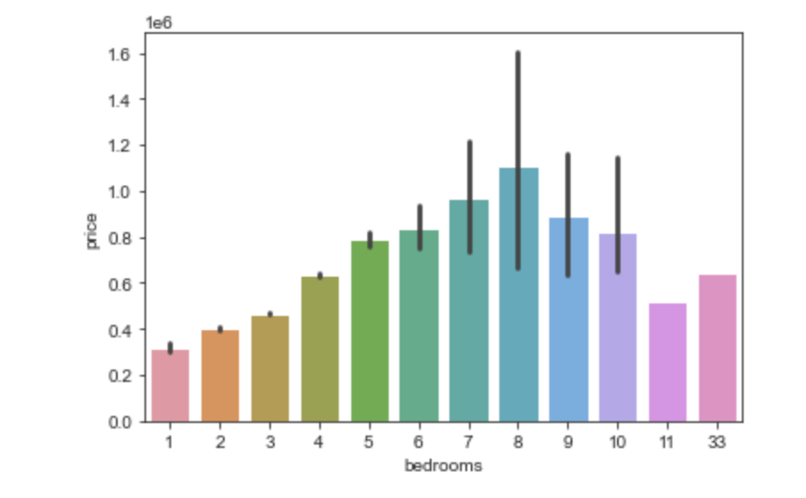

# Phase Two Project Repo
### Overveiw
Analysis of house price data and a predictive model to estimate the cost of a house based off multiple features.

### Busness Problem:
A Seattle real estate firm would like to create a tool that allows their clients to enter information about their home and receive a prediction for their home's sale price. They have hired you to produce a predictive model that can predict the sale price of a home as accurately as possible.

### Comparision 
The correlation between price and each feature was evaluated to examine the importance of each in the model.  This was done by graphing each relationship.  This was used to answer questions like, how mcuh does sqft_living affect the price of a home.  This can also show us any outliers in the feature.

### Data
From the house data we gatherd 12 features related to price containing 21597 rows of data.  We narrowed this down to 11 features and 14178 rows of data.  This was done by removing outliers and null values and checking correlations.

### Results

### Bedroom and Price Correlation

### Price and sqft_living Correlation

### Waterfront and Price Correlation

### Floors and Price Correlation

### Grade and Price Correlation

### View and Price Correlation

### Model Preformance

### Conclusion

Our model preforms well in prices from 385000-535000 dollars but has high error with prices from 77999-322000 and 645000-7700000 dollars.  sqft_living, bedrooms, and grade are have high correlations with price.